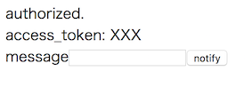
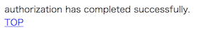

# LINE Notify ペライチ

LINE Notify ペライチ script in PHP.

## Setup LINE Notify

Please set `http://localhost:8000/callback` to the callback URL.

## Start with build-in web server

```
composer install
export LINE_NOTIFY_CLIENT_ID="XXX"; export LINE_NOTIFY_CLIENT_SECRET="XXX";  php -S localhost:8000
```

## Pages

### /

#### Redirect to LINE login


After authentication, it will be transferred to the `/callback`.

#### Top




### /callback



### /notify


And it will be notified to LINE.
